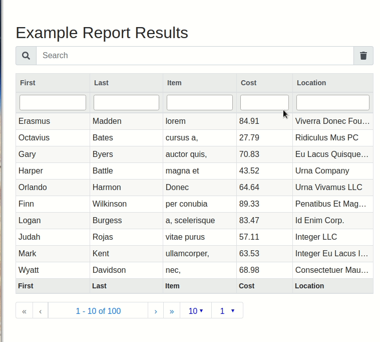

 # DataReports

**DataReports** é uma ferramenta em Python para a automação de relatórios personalizados, permitindo análise de dados eficiente e geração de relatórios em diversos formatos.

---

## 📂 Estrutura do Projeto

Abaixo está a descrição de cada diretório e arquivo principal no projeto:

### Diretórios

- **`datareports/`**  
  Contém os módulos principais do código-fonte, incluindo funções para análise de dados, manipulação e geração de relatórios.

- **`npm/`**  
  Inclui arquivos relacionados ao uso de pacotes JavaScript/NPM para funcionalidades adicionais ou compatibilidade.

- **`test/`**  
  Diretório com os testes automatizados para garantir a funcionalidade e estabilidade do código.

### Arquivos Principais

- **`.bumpversion.cfg`**  
  Configuração para versionamento automatizado do projeto.

- **`.gitignore`**  
  Lista de arquivos e diretórios ignorados pelo controle de versão Git.

- **`LICENSE.txt`**  
  Arquivo contendo a licença de uso do projeto.

- **`MANIFEST.in`**  
  Especifica arquivos adicionais que devem ser incluídos na distribuição do pacote.

- **`Pipfile` e `Pipfile.lock`**  
  Gerenciamento de dependências do projeto usando o Pipenv.

- **`build.sh`**  
  Script para automatizar a construção e configuração do ambiente de desenvolvimento ou produção.

- **`datareports-demo.gif`**  
  Exemplo visual demonstrando o funcionamento do projeto.

- **`package-lock.json`**  
  Arquivo gerado pelo NPM para controle de dependências JavaScript.

- **`setup.py`**  
  Arquivo de configuração para instalação do projeto como um pacote Python.

- **`test.py`**  
  Script de testes para validação do projeto.

- **`version`**  
  Contém informações sobre a versão atual do projeto.

---

## ⚙️ Tecnologias Utilizadas

- **Linguagem:** Python 3.x  
- **Gerenciamento de Dependências:** Pipenv e NPM  
- **Outras Ferramentas:** 
  - Automação com `build.sh`
  - Geração de relatórios customizados

---

## 🚀 Como Usar

### 1. Clone o Repositório
```bash
git clone https://github.com/usuario/datareports.git
cd datareports
```

### 2. Configure o Ambiente
**Usando Pipenv:**  
```bash
pipenv install
pipenv shell
```

### 3. Execute o Script
```bash
python datareports/main.py
```

---

## 🧪 Testes

Rode os testes com o comando:  
```bash
python -m unittest discover test/
```

---

## 📄 Licença

Este projeto está sob a licença MIT. Consulte o arquivo [LICENSE.txt](LICENSE.txt) para mais detalhes.

---

## ✨ Exemplo Visual



---

## 📌 Contribuições

Contribuições são bem-vindas! Abra uma issue ou envie um pull request com suas melhorias.

---

## ✉️ Contato

Dúvidas ou sugestões? Entre em contato pelo e-mail: [yan_sales@hotmail.com](mailto:yan_sales@hotmail.com)
```
